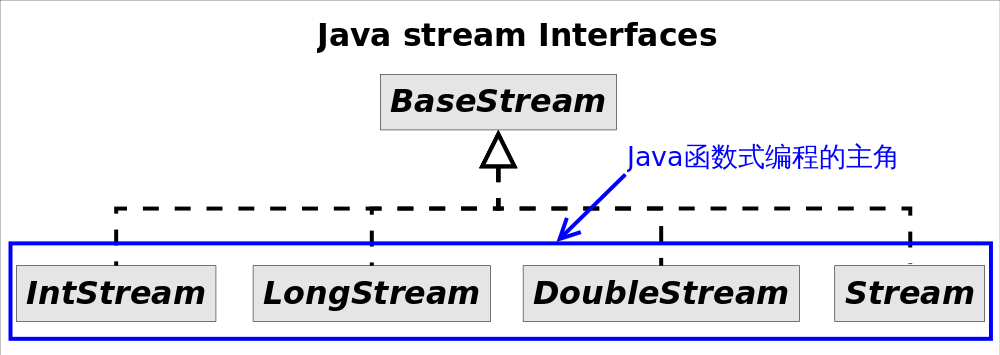

# Streams API

`java8`添加了众多函数式编程功能。作用有二：(1)代码简介，使用`stream`告别`for`循环。(2)多核友好，直接调用`parallel()`编写并行程序。

`stream`不是某种数据结构，只是一种数据源(数组，容器或I/O channel等)的视图。`stream`一般调用对应的工具方法创建而不是手动创建。



如图所示，3种`stream`结构均继承自`BaseStream`，其中`IntStream, LongStream, DoubleStream`对应三种基本类型（`int, long, double`，注意不是包装类型），`Stream`对应所有剩余类型的*stream*视图。为不同的数据类型设置不同的`stream`的好处就是：(1)提高性能，(2)增加特定接口函数。这里不将`IntStream`设置成`Stream`子接口的原因是二者的方法名大多相同，但是返回类型却不同。

`Stream`和`collections`的区别：

- **无存储**，`Stream`不是数据结构，也不是数据源，只是数据源的一个视图。
- **为函数式编程而生**：对*stream*的任何修改都不会修改背后的数据源，而是产生他一个新的`stream`。
- **惰式执行**。*stream*上的操作并不会立即执行，只有等真正需要结果的时候才会执行。
- **可消费性**。*stream*只能被“消费”一次，一旦遍历过就会失效，就像容器的迭代器那样，想要再次遍历必须重新生成。

## stream常见接口方法

`stream`的接口分为中间操作和结束操作，最简单的区分方式就是看返回值：中间操作绝大多数都是返回`stream`。

| 操作类型 | 接口方法                                                     |
| ------------- | ------------------------------------------------------------ |
| 中间操作 | concat() distinct() filter() flatMap() limit() map() peek()   skip() sorted() parallel() sequential() unordered() |
| 结束操作 | allMatch() anyMatch() collect() count() findAny() findFirst()   forEach() forEachOrdered() max() min() noneMatch() reduce() toArray() |

```java
// void forEach(Consumer<? super E> action)
// forEach是结束方法，代码立即执行，遍历元素执行action操作
stream.forEach(str -> doAction(str));

// Stream<T> filter(Predicate<? super T> predicate)
// filter是中间操作，不会立即执行，作用是返回只包含predicate条件元素的stream
stream.filter(str -> str.length() == 3).forEach(str -> doAction(str));

// Stream<T> distinct()
// 中间操作，返回去除重复元素之后的stream
stream.distinct().forEach( .......... );

// Stream<T>　sorted(), Stream<T>　sorted(Comparator<? super T> comparator)
// 中间操作，返回自然排序或自定义排序比较器的排序结果
stream.sort((str1, str2) -> str1.length() - str2.length()).forEach(...);

// <R> Stream<R> map(Function<? super T,? extends R> mapper)
// 返回对当前所有元素执行mapper操作之后的结果的stream
stream.map(str -> str.toUpperCase()).forEach(...);

// <R> Stream<R> flatMap(Function<? super T,? extends Stream<? extends R>> mapper)
// 对每个元素执行mapper操作，将所有mapper返回的stream元素组成一个新的stream作为返回结果
// Stream<List<Integer>> --flatMap--> Stream<Integer>
Stream<List<Integer>> stream = Stream.of(Arrays.asList(1,2), Arrays.asList(3, 4, 5));
stream.flatMap(list -> list.stream()).forEach(...);	// return [1,2,3,4,5]
```

## Stream规约操作

`stream`的规约操作(reduction operation)也称为折叠操作(fold)，通过某个链接动作将所有元素汇总成一个结果。例如：元素求和，最大最小值等。`stream`的通用规约操作是`reduce()`和`collect()`，为了简化书写设计的专用规约操作为：`sum()`, `max()`, `min()`, `count()`等。

### reduce

`reduce`操作实现从一组元素生成一个值，`sum(), max(), min(), count()`都是`reduce`操作。多个参数的作用只是为了指明初始值（参数*identity*），或者是指定并行执行时多个部分结果的合并方式（参数*combiner*）。

```java
Optional<T> reduce(BinaryOperator<T> accumulator)
T reduce(T identity, BinaryOperator<T> accumulator)
<U> U reduce(U identity, BiFunction<U,? super T,U> accumulator, BinaryOperator<U> combiner)
    
// 求最长的单词，Optinal是为了避免null带来的麻烦
// Optional<String> longest = stream.max((s1, s2) -> s1.length()-s2.length());
Optional<String> longest = stream.reduce((s1, s2) -> s1.length()>=s2.length() ? s1 : s2);
// 求一组单词的长度之和
Integer lengthSum = stream.reduce(0,　// 初始值
        (sum, str) -> sum+str.length(), // 累加器，将字符串映射成长度并相加
        (a, b) -> a+b);　// 部分和拼接器，并行执行时才会用到
```

### collect

​    如果某个功能在`stream`的接口中没有找到，有很大的可能性是通过`collect()`实现。

#### 默认方法和静态方法

```java
// java8 中允许接口加入具体的方法，分为default方法和static方法。identify()是Function接口的静态方法，返回一个和输入一样的Lambda对象，等价于`t -> t`。java的default方法是为了避免修改接口之后让所有的实现类都需要重新实现，因为如果直接在接口类中添加抽象方法会导致接口的类需要重新实现，添加default和static方法则无影响（static方法是为了避免再写专门的工具类）。
List<String> list = stream.collect(Collectors.toList());
Set<String> set = stream.collect(Collectors.toSet());
Map<String, Integer> map = stream.collect(Collectors.toMap(Function.identity(), String::length));
```

#### 方法引用

方法引用的形式就是`String::length`。分为静态方法引用(`Integer::sum`)，引用某个对象的方法(`list::add`)，引用某各类的方法(`String::length`)，引用构造方法(`HashMap::new`)。

#### 收集器

收集器(`Collector`)是为`stream.collect()`方法量身打造的工具接口(类)，将`stream`转换成新的容器需要：(1)指定目标容器；(2)指定新元素添加到目标容器中的方法；(3)如果需要并行规约，需要指定多个结果合并的方式。`collect()`方法定义的三个参数依次对应上面的3条规则：
```java
<R> R collect(Supplier<R> supplier, BiConsumer<R,? super T> accumulator, BiConsumer<R,R> combiner)
// stream转list的方式
list = stream.collect(ArrayList::new, ArrayList::add, ArrayList::addAll);	// 方式1
// 通常情况不需要手动指定3个参数，直接调用collect(Collector<? super T,A,R> collector)的方法即可
list = stream.collect(Collectors.toList());	//方式2
```

方式2可以满足绝大部分需求，但是方式2的返回结果是接口类型，实际上并不知道类库实际选择的容器类型是什么，可以通过`Collectors.toCollection(Supplier<C> collectionFactory`指定容器类型。

```java
ArrayList<String> arrayList = stream.collect(Collectors.toCollection(ArrayList::new));// (3)
HashSet<String> hashSet = stream.collect(Collectors.toCollection(HashSet::new));// (4)
```

#### 使用collect生成Map

`stream`依赖的数据源是数组等容器，但不能是`Map`，反过来使用`stream`生成`map`是可行的。

方式1：直接使用`Collectors.toMap()`生成的收集器，需要用户指定如何生成`key`和`value`：

```java
// 使用toMap()统计学生GPA
Map<Student, Double> studentToGPA =
     students.stream().collect(Collectors.toMap(Function.identity(),// 如何生成key
```

方式2：使用`partitioningBy()`生成的收集器，这种情况适用于将`Stream`中的元素依据某个二值逻辑（满足条件，或不满足）分成互补相交的两部分，比如男女性别、成绩及格与否等。

```java
// Partition students into passing and failing
Map<Boolean, List<Student>> passingFailing = students.stream()
         .collect(Collectors.partitioningBy(s -> s.getGrade() >= PASS_THRESHOLD));
```

情况3：使用`groupingBy()`生成的收集器。跟`SQL`中的`group by`语句类似，这里的`groupingBy()`也是按照某个属性对数据进行分组，属性相同的元素会被对应到`Map`的同一个`key`上。

```java
// Group employees by department
Map<Department, List<Employee>> byDept = employees.stream()
            .collect(Collectors.groupingBy(Employee::getDepartment));
```

`groupBy`除了对分组的基本用法以外，还有增强型。增强版的`groupingBy()`允许我们对元素分组之后再执行某种运算，比如求和、计数、平均值、类型转换等。这种先将元素分组的收集器叫做**上游收集器**，之后执行其他运算的收集器叫做**下游收集器**(*downstream Collector*)。

```java
/***********************************难度较大，仔细看*****************************************/
// 使用下游收集器统计每个部门的人数
Map<Department, Integer> totalByDept = employees.stream()
                    .collect(Collectors.groupingBy(Employee::getDepartment,
                                                   Collectors.counting()));// 下游收集器
// 按照部门对员工分布组，并只保留员工的名字
Map<Department, List<String>> byDept = employees.stream()
                .collect(Collectors.groupingBy(Employee::getDepartment,
                        Collectors.mapping(Employee::getName,// 下游收集器
                                Collectors.toList())));// 更下游的收集器
```

#### collect()做字符串join

使用`Collectors.joining()`生成的收集器替代`for`循环拼接字符串，可以使用3种方式：

```java
// 使用Collectors.joining()拼接字符串
Stream<String> stream = Stream.of("I", "love", "you");
//String joined = stream.collect(Collectors.joining());// "Iloveyou"
//String joined = stream.collect(Collectors.joining(","));// "I,love,you"
String joined = stream.collect(Collectors.joining(",", "{", "}"));// "{I,love,you}"
```