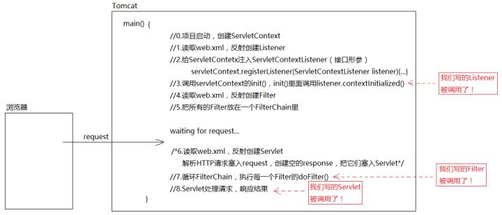
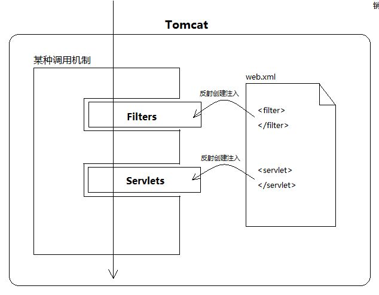
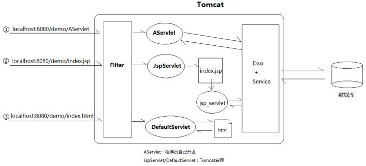
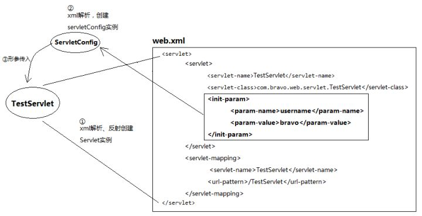
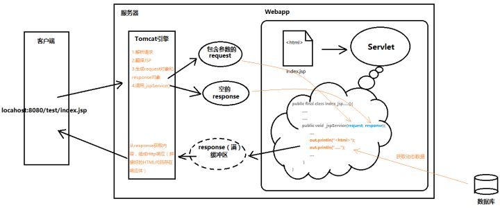

# servlet

## servlet简介

`servlet`本身只是`java`的一接口，包含5个方法。接口的作用是定义规范，具体功能由实现类确定。具体到`servlet`接口，定义的是处理网络请求的规范，也就是规定了这3个方面：

> 1. 初始化要做什么
> 2. 销毁时要做什么
> 3. 接收请求时做什么

```java
public interface Servlet {
	public void init(ServletConfig config) throws ServletException;
    
    public ServletConfig getServletConfig();
    
    public void service(ServletRequest req, ServletResponse res) 
        throws ServletException, IOException;
    
    public String getServletInfo();
    
    public void destroy();
}
```

`servlet`本身并不直接和客户端打交道（这就意味着`servlet`不会有直接监听8080端口之类的行为）。请求通过`servlet`容器来到`servlet`，例如`tomcat`就是最常用的`servlet`容器。

`tomcat`直接和客户端打交道，通过监听端口，当请求过来后根据`url`等信息决定将请求交给那个`servlet`处理，调用对应`servlet`的`service()`方法并处理`service()`方法返回的`response`对象。

## spring MVC和servlet

> `spring`家族出现之后，`servlet`开始退居幕后，取而代之的是`Spring MVC`。`Spring MVC`的核心组件`DispatcherServlet`本质就是一个`servlet`。不过它已经自立门户，在原来的`HttpServlet`的基础上又封装了一条逻辑。

## Tomcat

有了`Tomcat`之后，我们已经变得不知道谁调用了这个程序。执行过程简单来说就是注入和回调。可以假设`Tomcat`中有一个`main()`方法，主要过程如下：

> 很多时候，框架就像是傀儡师，我们写的程序就是给傀儡化妆、打扮，实际运作都是傀儡师控制。只要我们实现xx接口，框架就会帮我们创建示例，搬运（接口注入）到合适的位置一套既定流程下来，执行我们的代码。







## 如何编写servlet

> 框架不会让我们写很难的代码。

进入`Tomcat`阶段之后，实际上就是面对接口编程。`servlet`虽然只是一个接口，但是实现类写写业务逻辑就行，业务逻辑代码和原始的、底层的解析、连接没有什么关系，最难的操作已经被封装为形参传入。`Tomcat`传入的三个对象分别是`ServletConfig`, `ServletRequest`, `ServletResponse`。

### ServletConfig

`Servlet`配置位于`web.xml`文件内，解析`xml`文件得到`ServletConfig`对象。



### ServletRequest

`Tomcat`封装并处理。`HTTP`请求到了`Tomcat`后，Tomcat通过字符串解析，把各个请求头（Header），请求地址（URL），请求参数（QueryString）都封装进了Request对象中。

### ServletResponse

`Tomcat`传给`Servlet`的`response`是空对象，`Servlet`逻辑处理后得到结果，通过`response.write()`方法，将结果写入`response`内部的缓冲区。`Tomcat`会在`servlet`处理结束后，拿到`response`，遍历里面的信息，组装成`HTTP`响应发给客户端。




